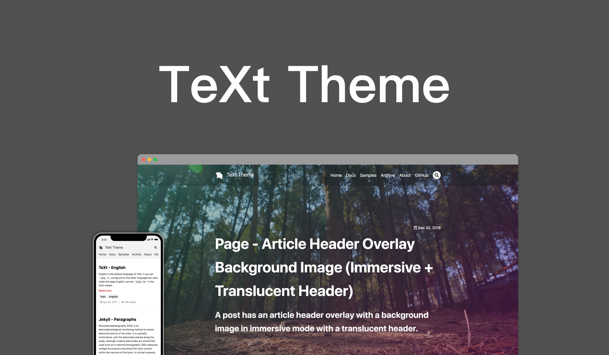

# [TeXt Theme](https://github.com/kitian616/jekyll-TeXt-theme)

这个gitPage页面clone自

## 特性

- 响应式
- HTML 语意化
- 皮肤
- 代码高亮主题
- 国际化
- 搜索
- 目录
- 作者（支持多个）
- 附加样式（提示，标签，图片，图标，按钮，栅格等）
- 扩展（音频，视频，幻灯片，在线示例）
- Markdown 增强（[MathJax](https://www.mathjax.org/)，[mermaid](https://mermaidjs.github.io/)，[chartjs](http://www.chartjs.org/)）
- 分享（[AddToAny](https://www.addtoany.com/)，[AddThis](https://www.addthis.com/)）
- 评论（[Disqus](https://disqus.com/)，[Gitalk](https://gitalk.github.io/)，[Valine](https://valine.js.org/en/)）
- 阅读量统计（[LeanCloud](https://leancloud.cn/)）
- 站点统计（[Google Analytics](https://analytics.google.com/analytics/web/)）
- RSS（[jekyll-feed](https://github.com/jekyll/jekyll-feed)）

## 皮肤

TeXt 内置有 6 套皮肤，你也可以定制自己的皮肤。

| `default` | `dark` | `forest` |
| --- |  --- | --- |
|  |  |  |

| `ocean` | `chocolate` | `orange` |
| --- |  --- | --- |
|  |  |  |

### 代码高亮主题

TeXt 使用 [Tomorrow](https://github.com/chriskempson/tomorrow-theme) 作为它的代码高亮主题。

| `tomorrow` | `tomorrow-night` | `tomorrow-night-eighties` | `tomorrow-night-blue` | `tomorrow-night-bright` |
| --- |  --- | --- | --- |  --- |
|  |  |  |  |  |

## 文档

### 开始

- [快速开始](https://tianqi.name/jekyll-TeXt-theme/docs/zh/quick-start)
- [从 1.x 升级到 2.x](https://tianqi.name/jekyll-TeXt-theme/docs/zh/update-from-1-to-2)

### 定制

- [配置](https://tianqi.name/jekyll-TeXt-theme/docs/zh/configuration)
- [导航栏](https://tianqi.name/jekyll-TeXt-theme/docs/zh/navigation)
- [布局](https://tianqi.name/jekyll-TeXt-theme/docs/zh/layouts)
- [Logo 和 Favicon](https://tianqi.name/jekyll-TeXt-theme/docs/zh/logo-and-favicon)
- [作者](https://tianqi.name/jekyll-TeXt-theme/docs/zh/authors)
- [国际化](https://tianqi.name/jekyll-TeXt-theme/docs/zh/i18n)

### 内容

- [撰写博客](https://tianqi.name/jekyll-TeXt-theme/docs/zh/writing-posts)
- [附加样式](https://tianqi.name/jekyll-TeXt-theme/docs/zh/additional-styles)
- [扩展](https://tianqi.name/jekyll-TeXt-theme/docs/zh/extensions)
- [Markdown 增强](https://tianqi.name/jekyll-TeXt-theme/docs/zh/markdown-enhancements)

## 示例

我的博客

## 其他资源

在 *_includes/svg/icon/social* 目录下有很多的社交产品图标，例如 Behance、Flickr、QQ、微信等，方便修改和使用。

## 协议

TeXt Theme 遵循 [MIT 协议](https://github.com/kitian616/jekyll-TeXt-theme/blob/master/LICENSE)。
