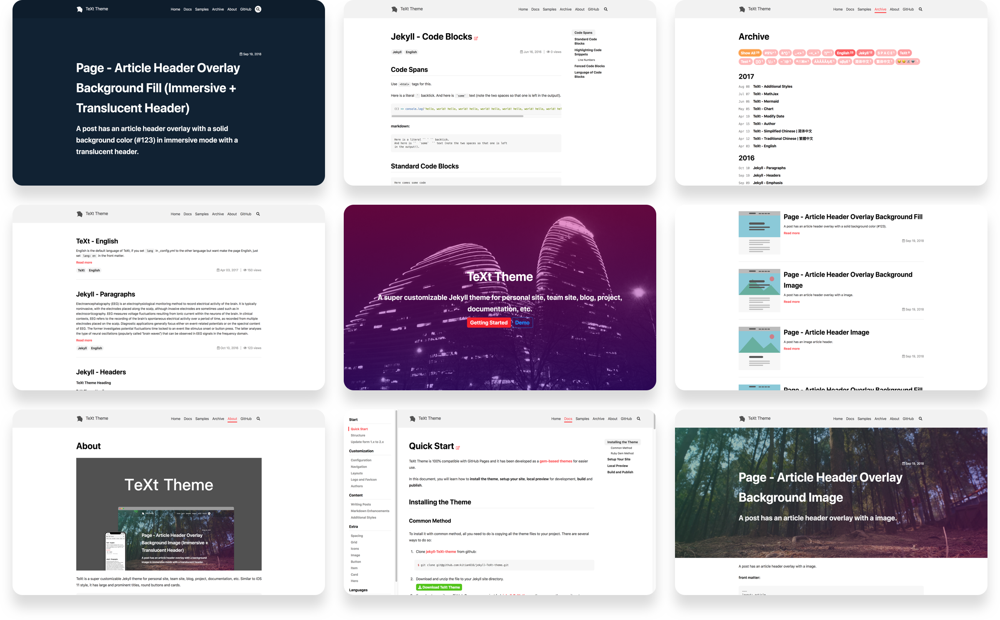
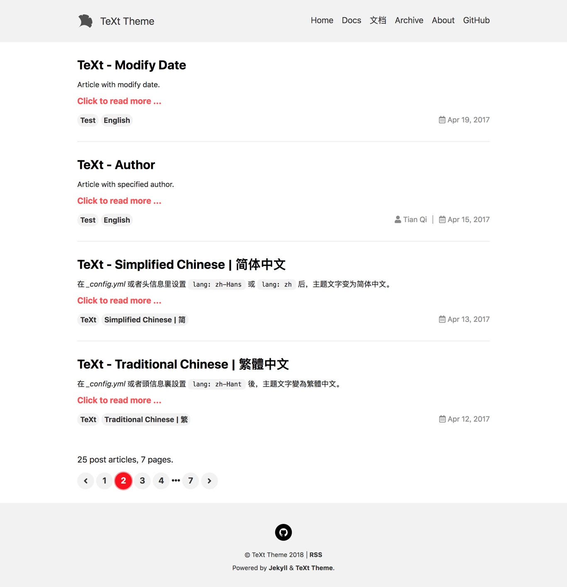
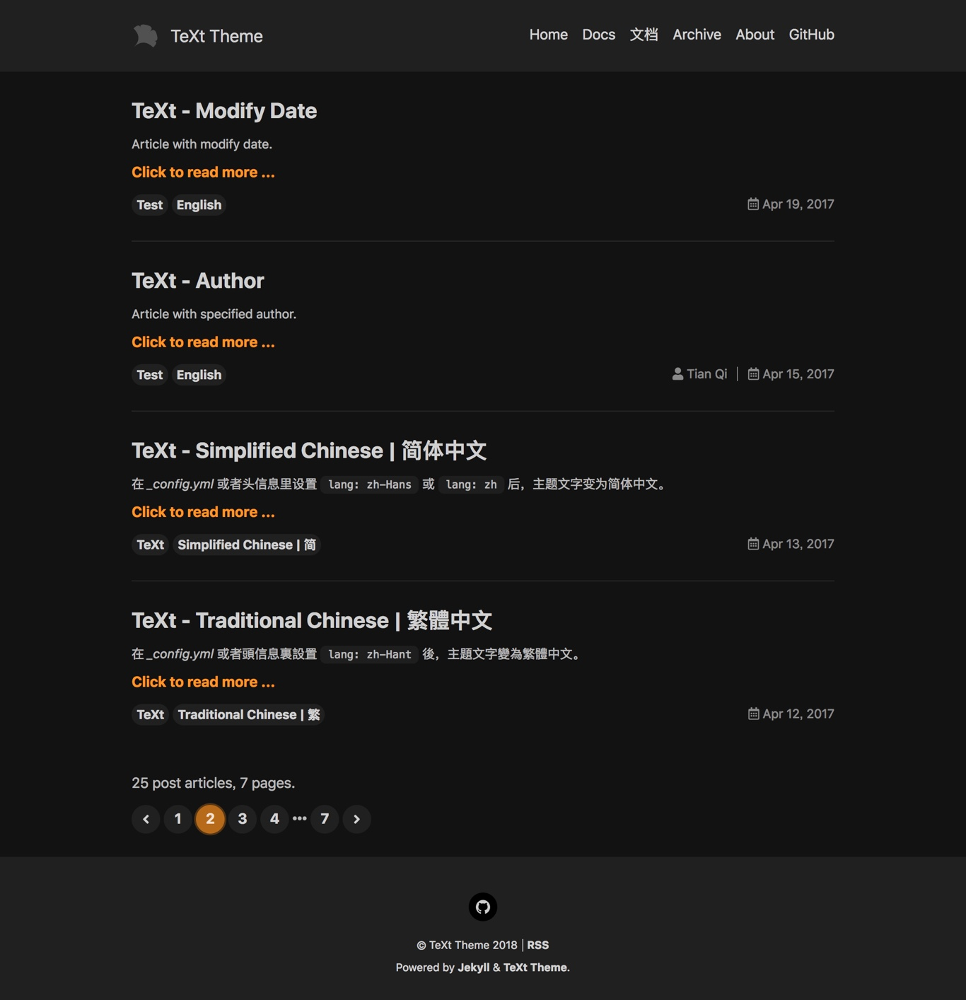
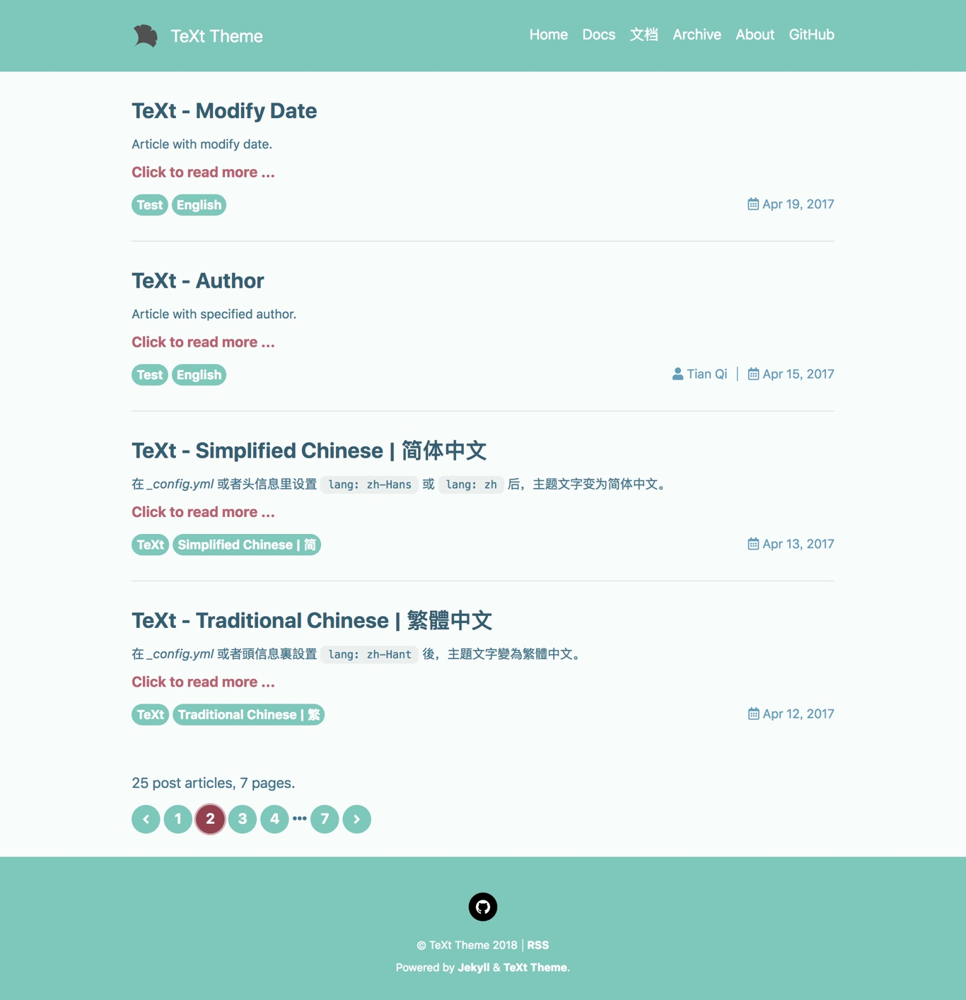
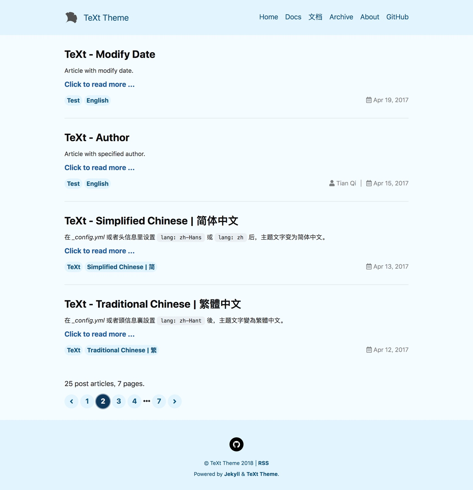
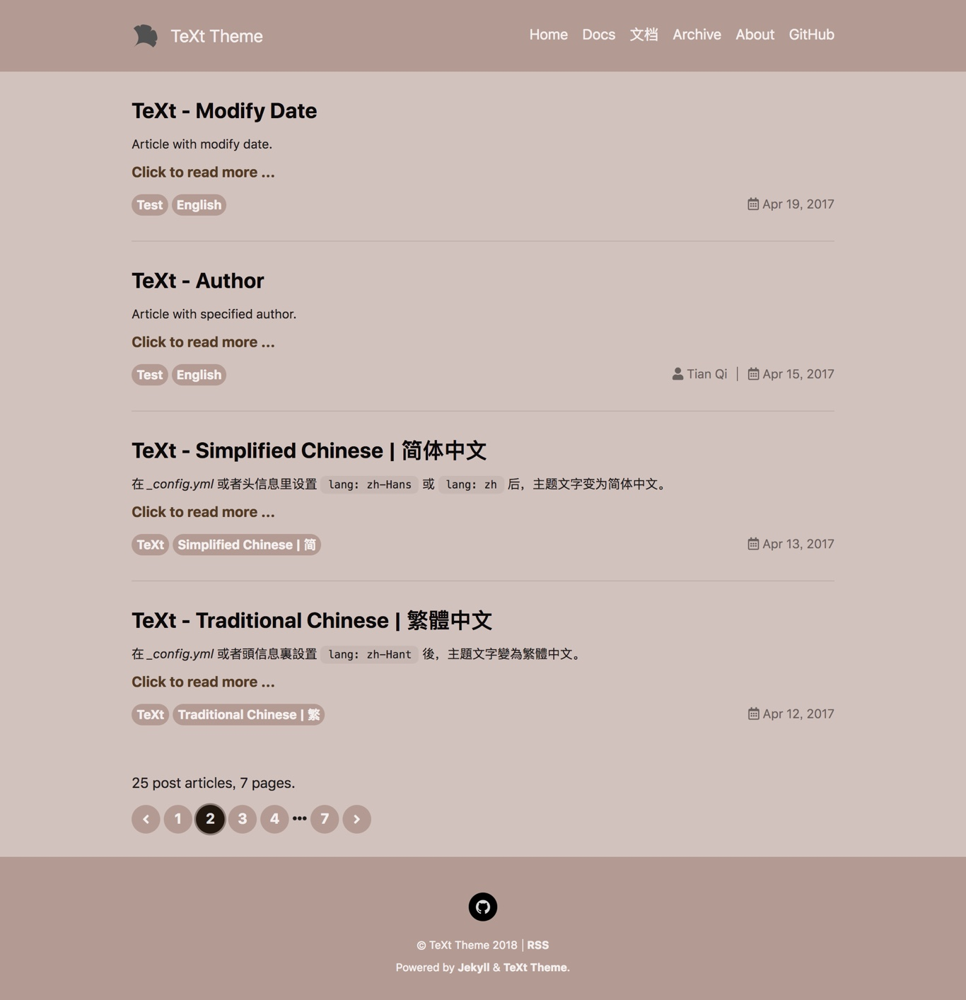
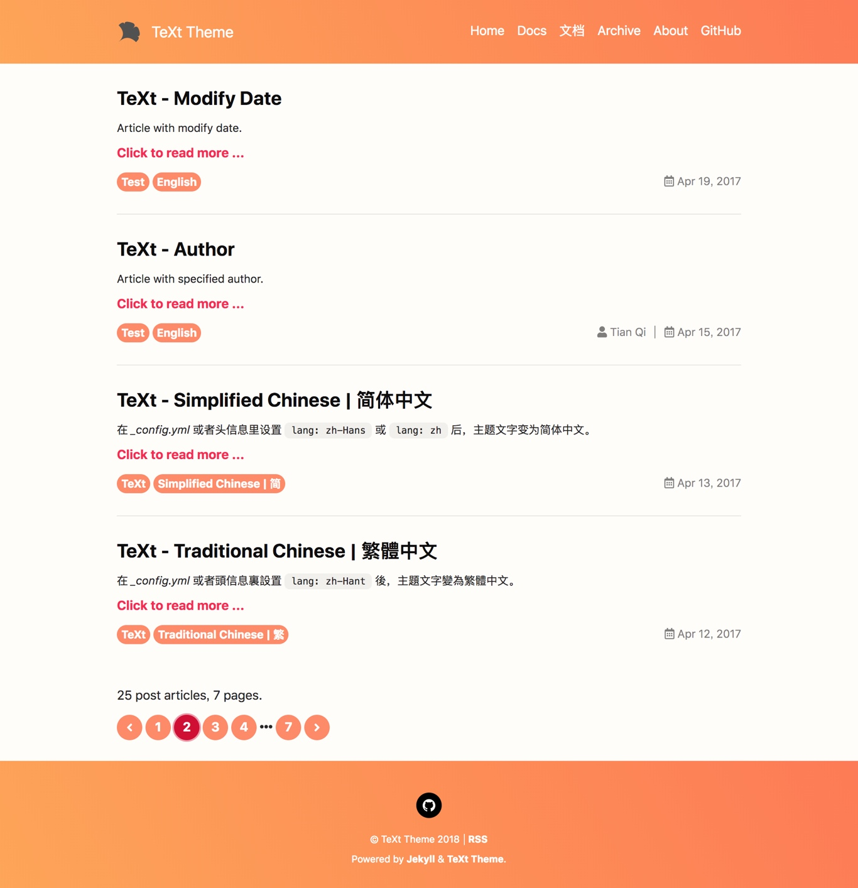
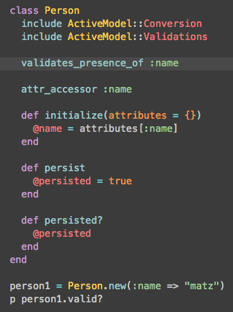
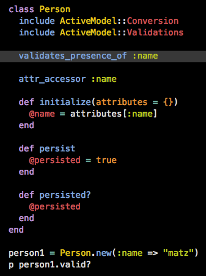

# TeXt Theme

这个GitPage Jekyll主题clone自 [jekyll-TeXt-theme](https://github.com/kitian616/jekyll-TeXt-theme) 。整体界面还是比较简洁，支持各种功能例如`LaTex`、图表等。[配置教程](https://tianqi.name/jekyll-TeXt-theme/docs/zh/quick-start)也比较详细。可以满足大部分需求。
[Jekyll](https://github.com/jekyll/jekyll) 是一个开源的博客静态网站生成器
>Jekyll is a simple, blog-aware, static site generator perfect for personal, project, or organization sites

也就是说你只顾写 `markdown`，**Web** 前端相关的都不用再学了，通过简单的操作就可以在自己的**服务器**上搭建一个自己的网站。不过，更方便的是，GitHub 提供了更人性化的便利，你甚至连服务器都不用买了，只需要把代码托管到 GitHub 上，它就会免费给你构建部署到GitHub服务器上，并且提供免费域名。这个域名就是 `github用户名.github.io` 。

## 特性

- 响应式
- HTML 语意化
- 皮肤
- 代码高亮主题
- 国际化
- 搜索
- 目录
- 作者（支持多个）
- 附加样式（提示，标签，图片，图标，按钮，栅格等）
- 扩展（音频，视频，幻灯片，在线示例）
- Markdown 增强（[MathJax](https://www.mathjax.org/)，[mermaid](https://mermaidjs.github.io/)，[chartjs](http://www.chartjs.org/)）
- 分享（[AddToAny](https://www.addtoany.com/)，[AddThis](https://www.addthis.com/)）
- 评论（[Disqus](https://disqus.com/)，[Gitalk](https://gitalk.github.io/)，[Valine](https://valine.js.org/en/)）
- 阅读量统计（[LeanCloud](https://leancloud.cn/)）
- 站点统计（[Google Analytics](https://analytics.google.com/analytics/web/)）
- RSS（[jekyll-feed](https://github.com/jekyll/jekyll-feed)）

## 皮肤

TeXt 内置有 6 套皮肤，你也可以定制自己的皮肤。

| `default` | `dark` | `forest` |
| --- |  --- | --- |
|  |  |  |

| `ocean` | `chocolate` | `orange` |
| --- |  --- | --- |
|  |  |  |

### 代码高亮主题

TeXt 使用 [Tomorrow](https://github.com/chriskempson/tomorrow-theme) 作为它的代码高亮主题。

| `tomorrow` | `tomorrow-night` | `tomorrow-night-eighties` | `tomorrow-night-blue` | `tomorrow-night-bright` |
| --- |  --- | --- | --- |  --- |
|  |  |  |  |  |

## 示例

我的博客 [kouyt5.github.io](http://kouyt5.github.io)

## 其他资源

在 `_includes/svg/icon/social` 目录下有很多的社交产品图标，例如 Behance、Flickr、QQ、微信等，方便修改和使用。

## 协议

TeXt Theme 遵循 [MIT 协议](https://github.com/kitian616/jekyll-TeXt-theme/blob/master/LICENSE) 。
