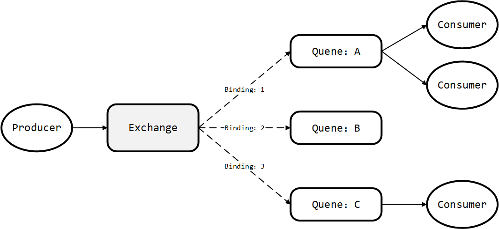

# rabbitMQ 分享

+ 消息中间件使用原因
+ rabbitMQ 构成
+ 代码简单分析
+ 项目展示与debug

## 消息中间件

### 案例分析
原始实验室音频组的智能语音平台系统架构组成：

<!-- </img> -->


+ 包含多个**深度学习算法** 
+ 服务端使用springMVC开发，提供用户友好的web界面
+ 算法端基于python
+ python算法与java服务的交流基于文件
    + java后端得到的前端数据存放在文件夹里，python算法端监听，然后进行处理
    + 处理完成后的结果存放在文件夹里
    + java使用同样的方式读取数据
+ 所有服务部署在同一台计算机上

### 缺点：
+ 算法模块与java后端高度耦合（依赖文件夹）
+ 多个算法部署在同一台计算机上，计算机处理瓶颈
+ 难以应付高负载的业务场景
+ 单台服务器宕机系统无法提供服务（分布式）

### 解决方案：消息中间件

java与python端的交互使用消息的形式，消息可以为任何形式的数据，例如音频，字符串，对象等。java端作为生产者产生消息，算法端作为消费者消费信息，降低了算法和后端的耦合度。同时，消息队列支持**集群分布式部署**，保证了服务的高可用性。

<!-- </img> -->

### 改进后的系统架构和物理架构：

<!-- </img></img> -->


算法部署在多台计算机上，降低服务器的压力，同时同一个算法可以部署多个实例，提高了系统的吞吐率与响应时间。

### 改进后系统优点

+ 解耦（java与算法端不存在较强的依赖关系）
+ 流量削峰（消息队列可以缓存消息，从而当算法来不及处理业务时时不会造成系统的崩溃）
+ 较为方便的对算法进行水平的拓展，提高单个算法的并行处理能力
+ 较高的容错率，当一台算法服务宕机后另一台计算机能够继续提供服务

## rabbitMQ构成

当前主流的消息队列有以下几种：

|特性|ActiveMQ|RabbitMQ|RocketMQ|Kafka|
|---|---|---|---|---|
|时效性|	ms 级|	微秒级|	ms 级|	ms 级|
|单吞吐量|	万级|	万级|	10 万级|	10 万级|
|可用性|	高|	高|	非常高|	非常高|
|优势|功能极其完备|并发能力很强，延时很低，后台管理较为全面|分布式，扩展性好|	大数据领域的实时计算以及日志采集|

### rabbitMQ 结构

<!-- </img> -->

+ Producer/Consumer：生产者消费者
+ Exchange：交换器，可以理解为队列的路由逻辑，交换器主要有三种
    + Direct(单播使用较多)
    + Fanout(广播)
    + Topic(特定规则)
+ Queue：队列
+ Binding：绑定关系，实际是交换器上映射队列的规则

RabbitMQ遵循 **AMQP协议**，RabbitMQ 的 broker 由 Exchange,Binding,queue 组成，其中 exchange 和 binding 组成了消息的路由键；客户端Producer通过连接 channel 和 server 进行通信，Consumer 从 queue 获取消息进行消费。

```python
import time,os,uuid,threading,logging
import pika
import msgpack
def create_connection(host, port, user, password):
    credentials = pika.PlainCredentials(username=user, password=password)
    connection = pika.BlockingConnection(
        pika.ConnectionParameters(host=host, port=port, credentials=credentials))
    return connection

class RabbitMQRpcClient(object):
    def __init__(self, host, port, user, password, timeout=180):
        self.connection = create_connection(host, port, user, password)
        self.channel = self.connection.channel()
        result = self.channel.queue_declare(queue='', exclusive=True)
        self.callback_queue = result.method.queue
        self.channel.basic_consume(
            queue=self.callback_queue,
            on_message_callback=self.on_response,
            auto_ack=True)
        self._corr_id = None
        self._response = None
        self.timeout = timeout

    def on_response(self, ch, method, props, body):
        if self._corr_id == props.correlation_id:
            self._response = body

    def call(self, call_queue, args):
        self._response = None
        self._corr_id = str(uuid.uuid4())
        body = msgpack.packb(args)
        self.channel.basic_publish(
            exchange='',
            routing_key=call_queue,
            properties=pika.BasicProperties(
                reply_to=self.callback_queue,
                correlation_id=self._corr_id,
            ),
            body=body)
        start_time = time.time()
        while self._response is None:
            current_time = time.time()
            if current_time - start_time > self.timeout:
                return None
            self.connection.process_data_events()
        return msgpack.unpackb(self._response)

class RabbitMQRpcServer(object):
    def __init__(self, host, port, user, password, service_queue, service):
        self.connection = create_connection(host, port, user, password)
        self.channel = self.connection.channel()
        self.channel.queue_declare(queue=service_queue)
        self.service_queue = service_queue
        self.service = service

    def on_request(self, ch, method, props, body):
        msg = msgpack.unpackb(body, raw=False)
        response = self.service(msg)
        response = msgpack.packb(response)
        ch.basic_publish(exchange='',
                         routing_key=props.reply_to,
                         properties=pika.BasicProperties(correlation_id=props.correlation_id),
                         body=response)
        ch.basic_ack(delivery_tag=method.delivery_tag)

    def start_service(self):
        self.channel.basic_qos(prefetch_count=1)
        self.channel.basic_consume(queue=self.service_queue, on_message_callback=self.on_request)
        self.channel.start_consuming()

class Service(object):
    def __init__(self):
        pass

    def __call__(self, args):
        return {'msg': 'hello from service'}

if __name__ == "__main__":
    HOST = '127.0.0.1'
    PORT = 5672
    USER_NAME = 'xxx'
    PASSWORD = 'password'
    QUEUE_NAME = 'queue name'
    # 测试 client
    client = RabbitMQRpcClient(HOST, PORT, USER_NAME, PASSWORD)
    logger.info(" [x] Requesting")
    response = client.call(QUEUE_NAME, {'x': 12})
    logger.info(" [.] Got %r" % response)

    #测试 Server
    service = Service()
    server = RabbitMQRpcServer(HOST, PORT, USER_NAME, PASSWORD, QUEUE_NAME, service)
    server.start_service()

```
rabbitMQ官方教程：https://www.rabbitmq.com/getstarted.html